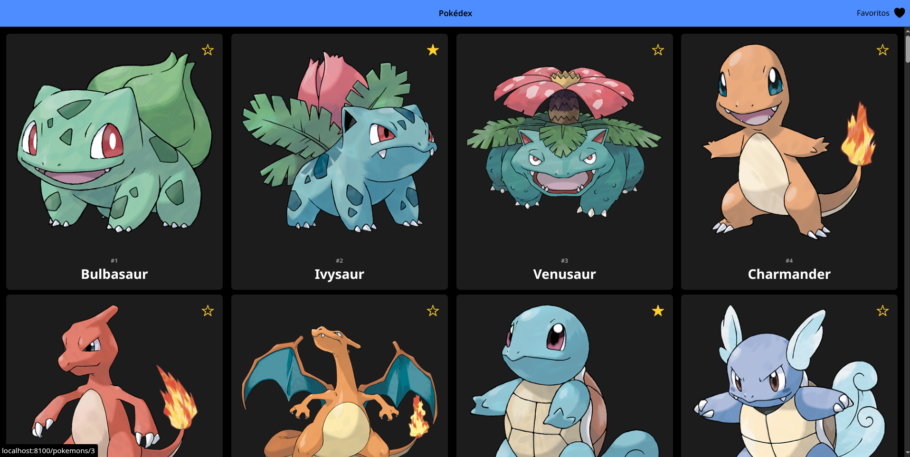
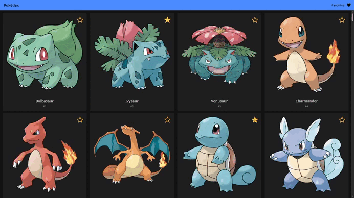
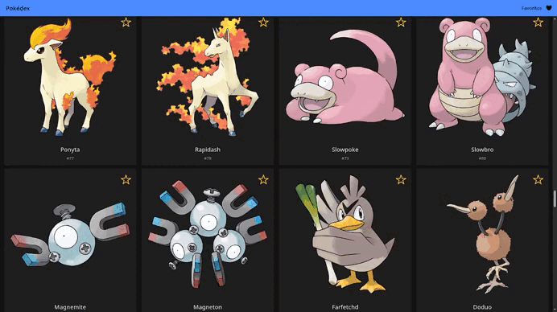

# Pokédex App com Ionic e Angular

[](https://pokedex-app-three-black.vercel.app/)



Este projeto é uma Pokédex moderna e responsiva, desenvolvida como um desafio técnico para demonstrar habilidades em desenvolvimento mobile híbrido. O objetivo foi criar uma aplicação funcional e bem-estruturada utilizando o framework Ionic com Angular. A abordagem de desenvolvimento priorizou um código limpo e legível, seguindo as melhores práticas do mercado, como a utilização de serviços para acesso a dados e componentes Standalone para modularidade.

O padrão de Injeção de Dependência foi usado para gerenciar os serviços de forma desacoplada, enquanto a programação reativa com RxJS foi empregada para lidar com a comunicação assíncrona com a PokeAPI. A interface foi construída para ser intuitiva e totalmente responsiva, adaptando-se a diferentes tamanhos e orientações de tela. O projeto também inclui funcionalidades avançadas, como um sistema de favoritos com persistência de dados no dispositivo. O resultado é uma demonstração prática de um ciclo de desenvolvimento completo, da concepção à documentação.

## ✨ Funcionalidades Principais

-   **Listagem Infinita:** Navegue por uma lista de Pokémons que carrega mais itens conforme você rola a tela.
-   **Design Responsivo:** A interface se adapta de uma lista vertical para uma grade em telas maiores ou no modo paisagem.
-   **Detalhes do Pokémon:** Veja informações detalhadas, como tipos, habilidades, altura, peso e outras imagens.
-   **Sistema de Favoritos:** Marque seus Pokémons preferidos e veja-os em uma lista dedicada. Os dados são salvos no seu dispositivo!
-   **Carregamento Otimizado:** A página de favoritos utiliza `forkJoin` para buscar dados de múltiplos Pokémons em paralelo, melhorando a performance.

## 🚀 Tecnologias Utilizadas

-   **Framework:** Ionic e Angular (com Componentes Standalone)
-   **Linguagem:** TypeScript
-   **Estilização:** SCSS
-   **Comunicação com API:** HttpClient e RxJS
-   **Armazenamento Local:** Ionic Storage
-   **Ícones:** Ionicons

## 🎬 Funcionalidades em Ação

### Sistema de Favoritos e Navegação


### Lista Responsiva e Rolagem Infinita


## 🛠️ Como Rodar o Projeto

1.  **Clone o repositório:**
    ```bash
    git clone [https://github.com/yuri-moraes/pokedex-app.git](https://github.com/yuri-moraes/pokedex-app.git)
    ```
2.  **Navegue até a pasta do projeto:**
    ```bash
    cd pokedex-app
    ```
3.  **Instale as dependências:**
    ```bash
    npm install
    ```
4.  **Execute o servidor de desenvolvimento:**
    ```bash
    ionic serve
    ```

## 🏗️ Abordagem e Padrões de Design

-   **Arquitetura Standalone:** Adoção da nova arquitetura de componentes Standalone do Angular para um código mais enxuto, modular e com menos boilerplate.
-   **Separação de Responsabilidades (SoC):** Os Serviços (`PokemonService`, `FavoriteService`) isolam a lógica de negócio e o acesso a dados, mantendo os Componentes focados apenas na interface do usuário.
-   **Injeção de Dependência (DI):** Padrão utilizado em toda a aplicação para fornecer serviços aos componentes de forma desacoplada, facilitando a manutenção e os testes.
-   **Programação Reativa:** Uso de `Observables` para lidar com a natureza assíncrona das chamadas HTTP e `forkJoin` para otimizar múltiplas requisições simultâneas.
-   **Interfaces (Contratos):** Definição de interfaces TypeScript (`PokemonDetails`, `PokemonResult`) para garantir a tipagem segura dos dados da API, resultando em um código mais robusto e com menos erros.
